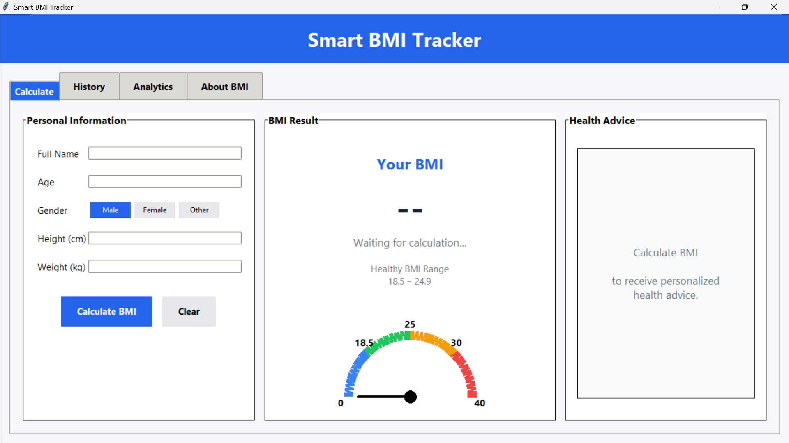
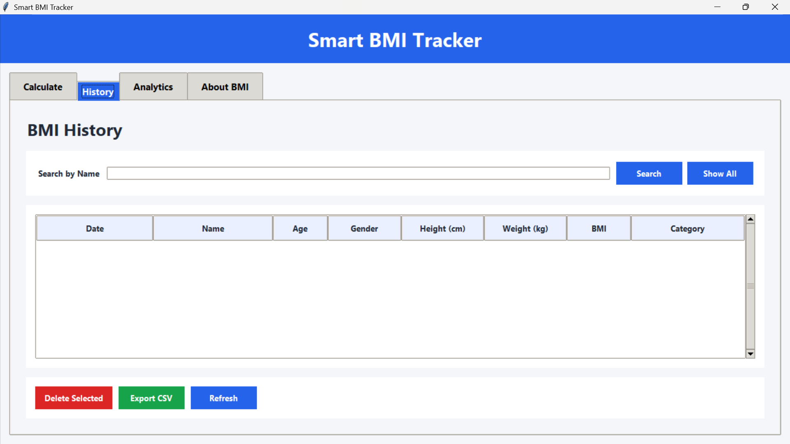
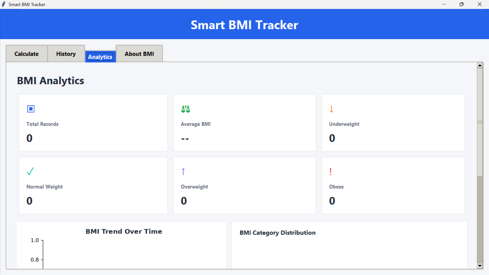
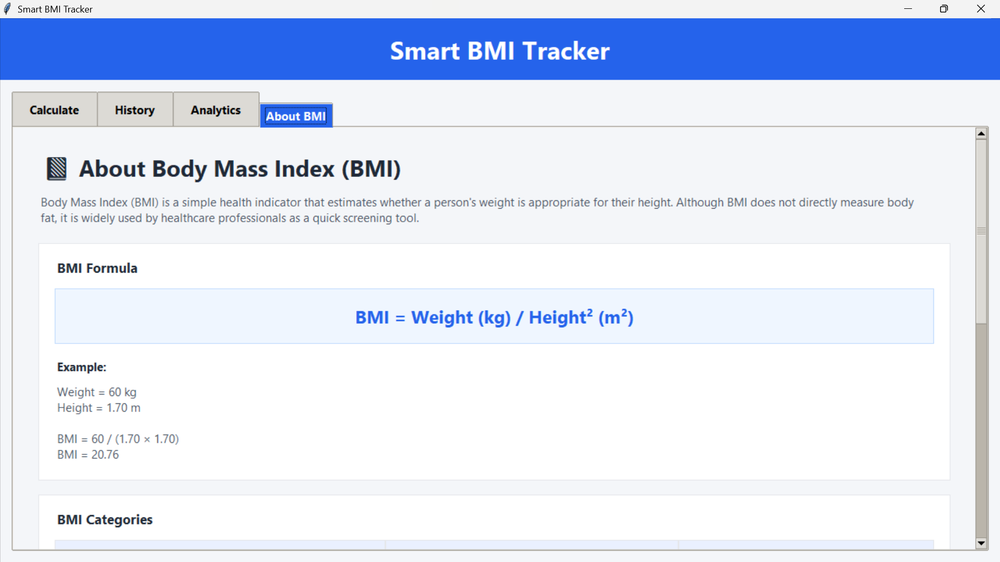

# Smart BMI Tracker

A professional desktop application for calculating and tracking Body Mass Index (BMI). Built with Python, Tkinter, SQLite, and Matplotlib.

## Features

- Calculate BMI using height and weight
- Accepts name, age, gender, height, and weight
- Classifies BMI into:
  - Underweight
  - Normal Weight
  - Overweight
  - Obese
- Animated BMI gauge
- Personalised health advice based on BMI category
- Save BMI records using SQLite
- Search, refresh, and delete BMI history records
- Export BMI history to CSV
- Analytics dashboard with:
  - Total records and average BMI
  - BMI category summary cards
  - BMI trend chart
  - BMI category distribution pie chart
- Scrollable Analytics dashboard
- Detailed About BMI page with BMI formula, categories, healthy tips, and disclaimer

## Input Limits

The application validates the following ranges before calculating and saving a BMI record:

| Input | Allowed Range |
|---|---|
| Age | 1 to 120 years |
| Height | 50 to 300 cm |
| Weight | 2 to 500 kg |

## BMI Formula

```text
BMI = Weight (kg) / Height² (m²)
```

Example:

```text
Weight = 60 kg
Height = 1.70 m

BMI = 60 / (1.70 × 1.70)
BMI = 20.76
```

## BMI Categories

| Category | BMI Range |
|---|---|
| Underweight | Below 18.5 |
| Normal Weight | 18.5 – 24.9 |
| Overweight | 25.0 – 29.9 |
| Obese | 30 and above |

## Technologies Used

- Python
- Tkinter
- SQLite
- Matplotlib

## Project Structure

```text
Python-Task2-BMICalculator/
├── Screenshots/
│   ├── about.png
│   ├── aboutpgdown.png
│   ├── aboutpgmiddle.png
│   ├── analytics.png
│   ├── analyticspgdown.png
│   ├── calculate.png
│   └── history.png
├── main.py
├── bmi.py
├── charts.py
├── database.py
├── export.py
├── requirements.txt
├── .gitignore
└── README.md
```

## Installation

1. Clone the repository:

```bash
git clone https://github.com/Dhaarani-PM/OIBSIP.git
```

2. Open the BMI project folder:

```bash
cd OIBSIP/Python-Task2-BMICalculator
```

3. Install the required dependency:

```bash
python -m pip install -r requirements.txt
```

## Run the Application

```bash
python main.py
```

## Screenshots

### BMI Calculator



### BMI History



### Analytics Dashboard



### About BMI



## Disclaimer

This application is intended for educational purposes only. BMI is only a screening tool and should not replace professional medical advice.

## Author

**Dhaarani P M**

Developed as part of the OASIS Infobyte Python Programming Internship.