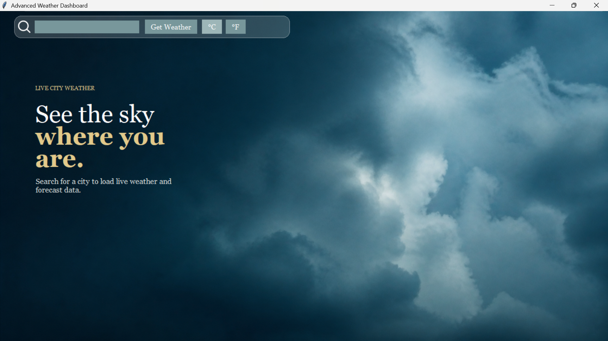
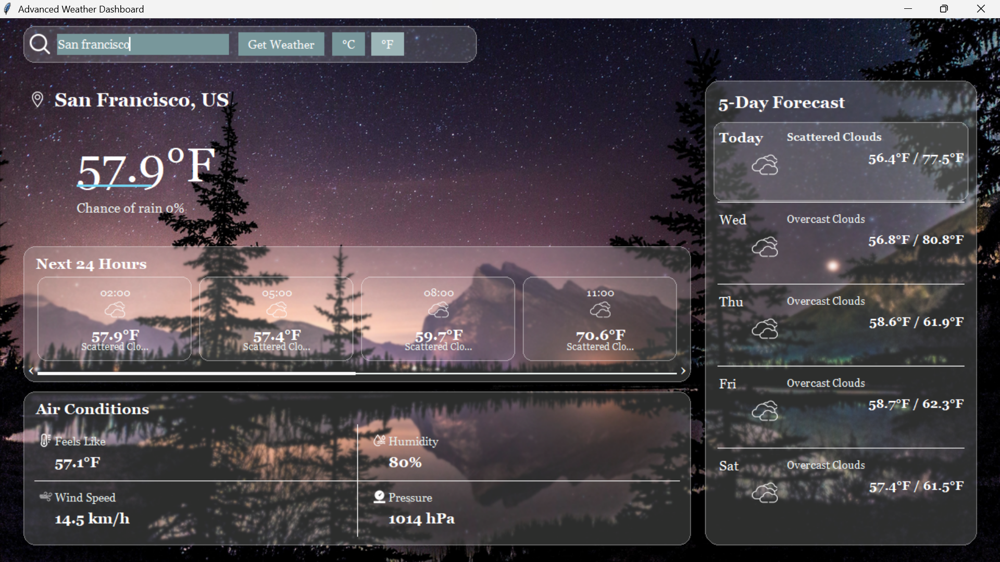
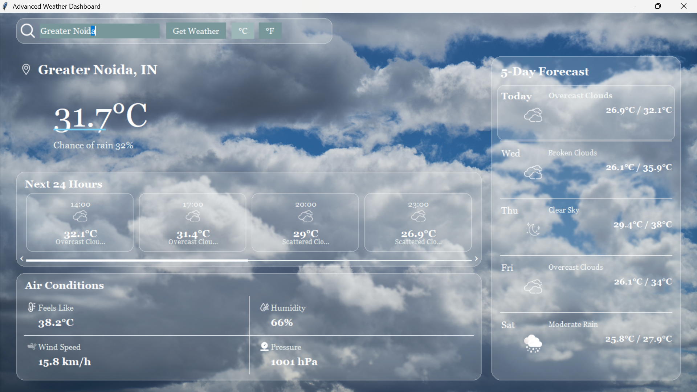
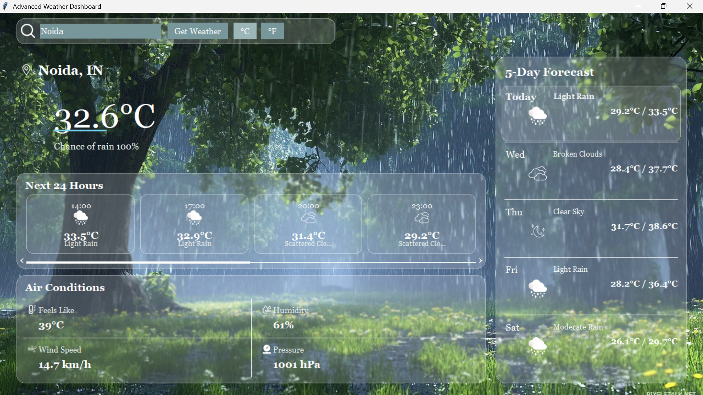

# Advanced Weather Dashboard

A professional desktop weather application for viewing live weather conditions and forecast information for different cities. Built with Python, Tkinter, OpenWeather API, and Pillow.

## Features

* Search weather by city
* Display current temperature and weather condition
* Display location information
* Display chance of rain
* Display feels-like temperature
* Display humidity
* Display wind speed
* Display atmospheric pressure
* Support for Celsius and Fahrenheit
* Next 24 hours weather forecast
* 5-day weather forecast
* Current day highlighted in the forecast
* Dynamic weather-condition-based backgrounds
* Local weather icons for different conditions
* Separate day and night backgrounds
* Automatic background selection based on weather conditions
* Dashboard-style graphical interface

## Weather Information

The dashboard displays the following information for the searched city:

| Information    | Description                         |
| -------------- | ----------------------------------- |
| Temperature    | Current temperature of the location |
| Condition      | Current weather condition           |
| Chance of Rain | Probability of precipitation        |
| Feels Like     | Perceived temperature               |
| Humidity       | Current humidity percentage         |
| Wind Speed     | Current wind speed                  |
| Pressure       | Atmospheric pressure                |
| Location       | City and country                    |

## Forecast

### Next 24 Hours

The hourly forecast provides upcoming weather information including:

* Forecast time
* Weather condition
* Weather icon
* Temperature

### 5-Day Forecast

The 5-day forecast provides:

* Day
* Weather condition
* Weather icon
* Minimum temperature
* Maximum temperature

The current day is visually highlighted so that today's weather can be identified quickly.

## Weather Backgrounds

The dashboard automatically changes its background according to the weather condition received from the OpenWeather API.

Backgrounds are available for conditions such as:

* Clear
* Clouds
* Rain
* Snow
* Thunderstorm
* Fog
* Night

The application also distinguishes between day and night conditions where applicable.

## Weather Icons

The application uses locally stored weather icons from the project's `assets/icons/` directory.

Available icons include:

* Clear day
* Clear night
* Cloudy
* Partly cloudy day
* Partly cloudy night
* Rain
* Snow
* Thunderstorm
* Fog
* Feels like
* Humidity
* Location
* Pressure
* Search
* Wind

## Temperature Units

The application supports both Celsius and Fahrenheit.

```text
Celsius     → °C
Fahrenheit  → °F
```

Users can switch between the two temperature units directly from the dashboard.

## Technologies Used

* Python
* Tkinter
* OpenWeather API
* Pillow
* REST API
* Git
* GitHub

## Project Structure

```text
Python-Task4-WeatherApp/
├── assets/
│   ├── backgrounds/
│   │   ├── cloudy.jpeg
│   │   ├── default_teal.png
│   │   ├── foggy.jpg
│   │   ├── night.jpg
│   │   ├── rainy.webp
│   │   ├── snowy.jpg
│   │   ├── stormy.jpg
│   │   └── sunny.jpeg
│   │
│   └── icons/
│       ├── clear_day.png
│       ├── clear_night.png
│       ├── cloudy.png
│       ├── feels_like.png
│       ├── foggy.png
│       ├── humidity.png
│       ├── location.png
│       ├── partly_cloudy_day.png
│       ├── partly_cloudy_night.png
│       ├── pressure.png
│       ├── rainy.png
│       ├── search.png
│       ├── snowy.png
│       ├── thunderstorm.png
│       └── wind.png
│
├── Screenshots/
│   ├── dashboard.png
│   ├── fahrenheit-night.png
│   ├── search-screen.png
│   └── rainy-weather.png
│
├── api.py
├── config.py
├── main.py
├── ui.py
├── utils.py
├── weather.py
├── requirements.txt
├── .gitignore
└── README.md
```

## Installation

### 1. Clone the Repository

```bash
git clone https://github.com/Dhaarani-PM/OIBSIP.git
```

### 2. Open the Weather Dashboard Folder

```bash
cd OIBSIP/Python-Task4-WeatherApp
```

### 3. Install the Required Dependencies

```bash
python -m pip install -r requirements.txt
```

### 4. Configure the OpenWeather API Key

Configure the OpenWeather API key according to the project's configuration.

Make sure the API key is stored securely and is not committed to the repository.

## Run the Application

```bash
python main.py
```

## Screenshots

### Weather Dashboard



### Fahrenheit and Night Mode



### Search Screen



### Rainy Weather



## API

This application uses the OpenWeather API to retrieve live weather and forecast data for searched locations.

The API provides the weather conditions, temperatures, forecast information, and location data used by the dashboard.

The weather information returned for the searched location is also used to select the appropriate weather background and icons.

## Disclaimer

This application is intended for educational purposes and demonstrates the use of Python, Tkinter, REST APIs, external weather data, and desktop GUI development.

Weather information is retrieved from the OpenWeather API and may vary depending on API availability and the accuracy of the provided data.

## Author

**Dhaarani P M**

Developed as part of the **OASIS Infobyte Python Programming Internship**.
